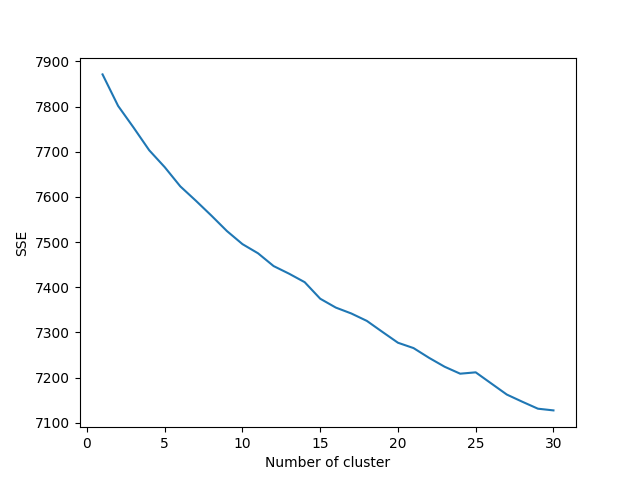
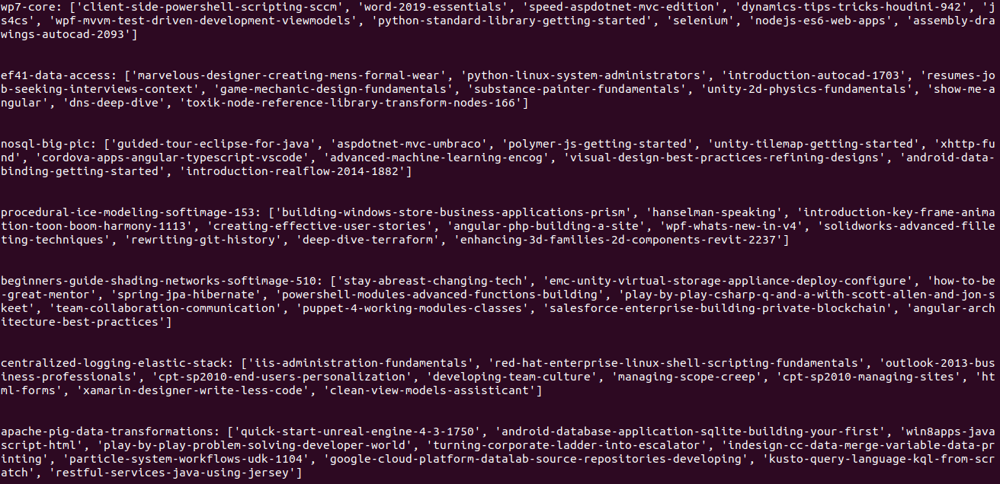
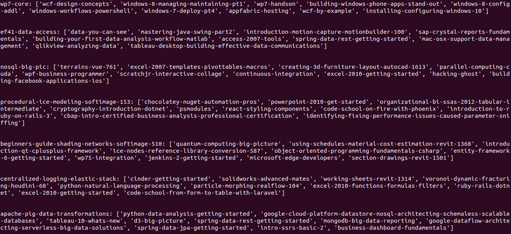

# Online-Course-Recommendation-System

Built on data fetched from Pluralsight's course API fetched results. Refer, their API to use the recent most data.  
Works with model trained on K-means unsupervised clustering algorithm on text data vectorized tf-idf algorithm.  

# Experiments

__Experiment 1:__ Using k=8 as categories that are present on Pluralsight are eight in number. Just, a basic intuition to get started
with.  

Issue with this approach is that that it results in an higher __SSE__ error as compared other higher values of _k_ as shown in below figure.  

### Elbow Experiment Plot
  

Elbow/Knee method is a good visualization experiment to know where the optimum number of clusters are present. Ideally at a point
where the error decreases drastically.  

__Experiment 2:__ Now, using k=30 as pointed by Elbow's method. The clusters formed are much more meaningful in this experiment. Observe, by printing the top 15 terms of both trained models with k=8 and 30 respectively. Also, for comparison see output screenshots of each clustering experiment.   

# To Get Started

1. Extract out the `finalized_model_k_8 or 30.zip` stored model's zip file first. As, it will be used by `recommend_util.py` file.
2. Extract out the `courses.csv` file. As, it will be used by `recommend_util.py` file for loading the data.
2. Simply, execute 'python3 recommend_util.py'. It will return results for some pre-loaded queries that are already
inserted in this file.

# Training Model

1. Run command 'python3 model_train_k_8.py or python3 model_train_k_30.py' for training the k-means model and storing it.

# Outputs

Observe the outputs for k = 8 and 30 for certain pre-defined courses. It is clearly visible that k=30 returns better recommendations
based on the clustering algorithm of respective trained models.

### Clusterization Output For K = 8
  

### Clusterization Output For K = 30
  

# Requirements

Make sure python(3.x), pandas, sklearn, pickle, numpy are present your system for running this module.

# Kudos !!
